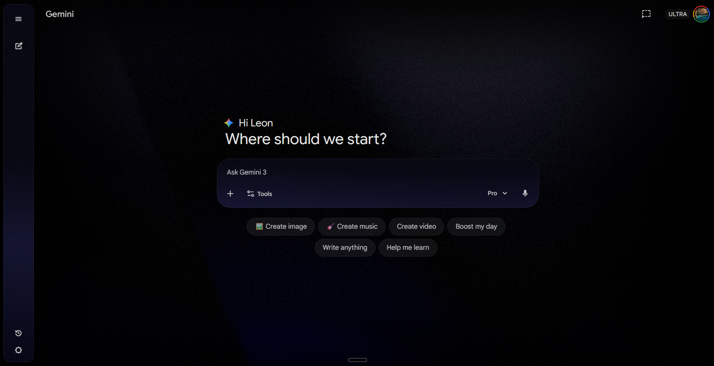

# Gemini UI Redesign

A Chrome extension that transforms Google Gemini into a personalized, premium dark experience.

Custom backgrounds · Floating sidebar · Per-zone darkness control · Canvas-compatible

[](https://developer.chrome.com/docs/extensions/)
[](https://developer.chrome.com/docs/extensions/mv3/intro/)
[](https://opensource.org/licenses/MIT)

---

## Overview

This extension overhauls the look and feel of [Google Gemini](https://gemini.google.com) without touching any functionality. Everything Gemini does still works as normal — you just get a much nicer interface on top.



### Features

- **Custom Background Images** — Upload your own wallpapers for the main background, sidebar, input field, and message bubbles
- **Per-Zone Darkness Sliders** — Fine-tune how dark the overlay is on each zone so your images look just right
- **Floating Sidebar** — The left sidebar becomes a rounded, elevated panel with a soft shadow
- **Premium Dark Theme** — Menus, dropdowns, chips, and buttons all get a cohesive dark treatment
- **Canvas Compatible** — Works correctly when Gemini's right-side Canvas panel is open, targeting the actual `immersive-panel` and `code-immersive-panel` elements

---

## Installation

Since this extension is not on the Chrome Web Store, you install it manually as an unpacked extension.

### 1. Download

```bash
git clone https://github.com/Leonxlnx/gemini-extension.git
```

Or click the green **Code** button on GitHub, then **Download ZIP** and unzip.

### 2. Load in Chrome

1. Open `chrome://extensions` in your browser
2. Enable **Developer mode** (toggle in the top-right corner)
3. Click **Load unpacked**
4. Select the `gemini-extension` folder

### 3. Open Gemini

Navigate to [gemini.google.com](https://gemini.google.com) — the redesign applies automatically.

---

## Customization

Click the extension icon in your Chrome toolbar to open the settings popup.

| Setting | Description |
|---|---|
| **Master Toggle** | Turn all custom backgrounds on or off |
| **Background** | Upload an image for the main page background |
| **Sidebar** | Upload an image for the left sidebar |
| **Input Field** | Upload an image for the chat input area |
| **Messages** | Upload an image for your sent message bubbles |
| **Darkness Sliders** | Adjust the dark overlay per zone (0% = full image, 80% = very dark) |

**Tips:**

- Use high-resolution images (1920x1080 or larger) for the best results.
- Dark, moody wallpapers work well since the UI is also dark-themed.
- The sidebar image is cropped to fit the narrow panel — vertical images work best.

---

## Project Structure

```
gemini-extension/
├── manifest.json      # Extension config (Manifest V3)
├── content.css        # All UI styling injected into Gemini
├── content.js         # Dynamic background and image logic
├── popup.html         # Settings popup layout
├── popup.css          # Settings popup styling
├── popup.js           # Settings popup logic
├── bg.webp            # Default background image
├── msg-bg.webp        # Default message/sidebar background
├── icon.svg           # Source icon
├── icon16.png         # Toolbar icon (16px)
├── icon48.png         # Extensions page icon (48px)
└── icon128.png        # Store icon (128px)
```

---

## How It Works

1. **`content.css`** is injected at `document_start`. It applies all visual restyling — floating sidebar, dark menus, Canvas panel theming — before the page renders.

2. **`content.js`** runs at `document_idle`. It loads custom images from `chrome.storage.local`, applies them as CSS background images with per-zone darkness overlays, and uses a `MutationObserver` to re-apply styles when Gemini dynamically updates the DOM.

3. **`popup.js`** handles the settings UI. Uploaded images are resized and converted to WebP, stored in local storage, and a message is sent to the content script to refresh styling in real time.

### Canvas Panel Integration

When Canvas is open, Gemini renders the following DOM structure:

```
chat-window.immersives-mode
├── div.chat-container          ← chat pane (left)
└── immersive-panel             ← canvas pane (right)
    └── code-immersive-panel
        ├── toolbar             ← Code/Preview toggle, Share, Close
        ├── web-preview         ← preview iframe
        ├── xap-code-editor     ← Monaco code editor
        ├── floating-toolbar    ← magic wand actions
        └── console             ← console output
```

The extension targets these specific custom elements to avoid interfering with the sidebar or main content layout.

---

## Updating

After pulling new changes:

```bash
git pull origin main
```

Then go to `chrome://extensions`, click the refresh icon on the extension card, and reload any open Gemini tabs.

---

## Contributing

Contributions are welcome.

1. Fork this repository
2. Create a feature branch: `git checkout -b feature/my-feature`
3. Make your changes
4. Test by loading the extension locally — check Gemini with the sidebar open/closed and Canvas open/closed
5. Commit with a descriptive message: `git commit -m "feat: description"`
6. Push and open a Pull Request

### Ideas

- More theme presets (light mode, accent color options)
- Chrome Web Store listing
- Firefox and Edge support
- Keyboard shortcuts for toggling backgrounds
- Multiple saved theme profiles

---

## Known Limitations

- **Gemini updates may break styling.** Google can change the DOM structure at any time. If something looks off after a Gemini update, please open an issue.
- **Storage quota.** Chrome's `storage.local` has a ~10 MB limit. Very large images may fail to save. The extension automatically resizes uploads to stay within limits.
- **Chrome only.** This extension uses Manifest V3 and is currently limited to Chrome and Chromium-based browsers.

---

## License

This project is open-source under the [MIT License](LICENSE).

---

Made by [Leon](https://github.com/Leonxlnx)
